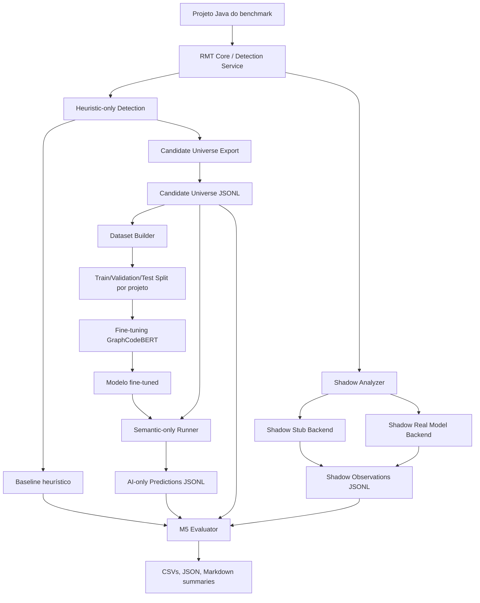

# SPEC.md — Arquitetura de Implementação: RMT + IA com Candidate Universe e Semantic-Only

## 1. Visão geral

Este documento especifica a evolução experimental da integração entre a Refactoring and Measurement Tool (RMT) e o módulo de Inteligência Artificial. A proposta organiza a ferramenta em modos de execução progressivos, permitindo sair de uma comparação puramente `shadow` para uma avaliação mais forte: verificar se um modelo semântico consegue aprender e reproduzir a referência operacional da RMT 2.0 a partir de rótulos gerados pela própria heurística.

A narrativa acadêmica central é:

> A heurística da RMT 2.0 pode ser utilizada como fonte de supervisão operacional para gerar rótulos programáticos sobre um universo de entidades candidatas. Com isso, avalia-se se um modelo semântico ajustado a partir dessas evidências é capaz de reproduzir o comportamento da ferramenta em um modo de execução mais autônomo.

Este projeto não deve ser apresentado como substituição definitiva da RMT 2.0, mas como uma expansão arquitetural e experimental que transforma a RMT em uma fonte de evidências para treinamento, validação e análise de modelos semânticos de código.

---

## 2. Objetivos

### 2.1 Objetivo principal

Implementar e documentar uma arquitetura experimental em que a RMT 2.0:

1. execute em modo heurístico puro para gerar baseline;
2. exporte um universo de entidades candidatas e não candidatas;
3. execute um backend simulado em modo shadow para validar integração e rastreabilidade;
4. execute o modelo real em modo shadow para comparar inferência semântica com a heurística;
5. execute um modo semantic-only/ai-only em que a IA decide sobre o universo de candidatos sem consultar a decisão final da heurística durante a inferência.

### 2.2 Objetivos acadêmicos

- Demonstrar que a RMT pode ser expandida com um módulo de IA preservando o pipeline determinístico.
- Demonstrar que o modo shadow permite avaliar modelos sem interferir na decisão final da ferramenta.
- Demonstrar que um backend stub/simulado é útil para validar contrato, comunicação, exportação e rastreabilidade antes do modelo real.
- Demonstrar que a heurística da RMT pode gerar rótulos operacionais para treinamento e avaliação de um classificador semântico.
- Comparar o comportamento da RMT 2.0 heurística com a RMT expandida por IA em diferentes modos de execução.

---

## 3. Não objetivos

Este projeto não pretende:

- provar superioridade absoluta da IA sobre a heurística da RMT;
- substituir a aplicação determinística de refatorações;
- permitir que o modelo gere código refatorado automaticamente;
- usar a IA para alterar o código-fonte sem validação da RMT;
- treinar e testar no mesmo conjunto sem deixar isso explícito;
- tratar a heurística da RMT como ground truth universal validada por especialistas.

---

## 4. Modos de execução

### 4.1 `heuristic-only`

Representa a RMT 2.0 original, sem ativação do módulo de IA.

Responsabilidades:

- executar a detecção heurística original;
- gerar a linha de base operacional;
- registrar tempo total da ferramenta;
- produzir candidatos detectados pela RMT;
- gerar rótulos operacionais para o universo de candidatos.

Uso acadêmico:

- serve como referência operacional;
- permite comparação direta com os modos baseados em IA;
- fornece a base de supervisão fraca/programática para treinamento do modelo.

---

### 4.2 `candidate-universe-export`

Modo ou etapa responsável por exportar entidades avaliáveis, incluindo positivos e negativos em relação à heurística.

Responsabilidades:

- exportar entidades candidatas aprovadas pela heurística;
- exportar entidades analisáveis que não foram aprovadas pela heurística;
- associar cada entidade a um rótulo operacional;
- preservar dados suficientes para treino, avaliação e rastreabilidade.

Uso acadêmico:

- evita que a IA seja treinada apenas com positivos;
- cria base para avaliar se o modelo distingue candidatos de não candidatos;
- permite treinar e testar um modelo semantic-only;
- fortalece a comparação direta entre heurística e IA.

---

### 4.3 `shadow-stub`

Modo shadow com backend simulado.

Responsabilidades:

- validar a comunicação RMT → IA;
- validar contrato HTTP/JSON;
- validar serialização e exportação JSONL;
- validar geração de `trace_id`;
- validar schema dos registros experimentais;
- validar pareamento posterior;
- não medir qualidade real da IA.

Uso acadêmico:

- comprova que o fluxo experimental funciona independentemente do modelo;
- reduz risco antes de executar o GraphCodeBERT;
- isola problemas de infraestrutura de problemas de inferência.

---

### 4.4 `shadow-real-model`

Modo shadow com inferência real.

Submodos:

- `zeroshot`: usa o modelo pré-treinado sem ajuste supervisionado específico da RMT;
- `fine-tuned`: usa modelo ajustado com rótulos derivados da RMT 2.0.

Responsabilidades:

- enviar as mesmas entidades avaliadas pela heurística para o serviço de IA;
- registrar previsões da IA sem alterar a decisão final da RMT;
- exportar observações rastreáveis;
- comparar previsões do modelo com a heurística.

Uso acadêmico:

- avalia aderência da IA à referência operacional;
- compara zero-shot e fine-tuned;
- mantém segurança experimental, pois a decisão final continua heurística.

---

### 4.5 `semantic-only` ou `ai-only`

Modo em que a IA toma a decisão sobre o universo de candidatos sem consultar a decisão heurística final durante a inferência.

Responsabilidades:

- receber entidades do candidate universe;
- executar inferência real;
- aplicar thresholds por padrão;
- produzir decisão própria da IA;
- comparar a decisão da IA com o rótulo operacional derivado da heurística.

Uso acadêmico:

- avalia se o modelo aprendeu a reproduzir o comportamento da RMT;
- representa uma etapa mais autônoma do módulo de IA;
- permite medir precisão, revocação, F1, taxa de concordância e curva por threshold;
- transforma a RMT em fonte de supervisão operacional para um classificador semântico.

Atenção metodológica:

- o modo semantic-only não deve ser apresentado como prova de verdade externa;
- ele demonstra reprodução/aproximação da RMT 2.0;
- para alegar superioridade real, seria necessária base independente validada por especialistas.

---

## 5. Arquitetura de alto nível



---

## 6. Componentes

### 6.1 RMT Core / Detection Service

Local provável:

- `detection-and-refactoring/`

Responsabilidades:

- processar projeto Java;
- executar heurísticas da RMT;
- identificar candidatos;
- manter aplicação determinística de refatorações;
- alimentar exportadores experimentais.

Não deve:

- depender internamente de detalhes do modelo Python;
- permitir que a IA aplique refatoração automaticamente;
- misturar decisão heurística com decisão IA no modo shadow.

---

### 6.2 Candidate Universe Exporter

Responsabilidades:

- exportar entidades avaliáveis em JSONL;
- registrar rótulos positivos e negativos derivados da RMT;
- preservar contexto suficiente para treino e avaliação;
- garantir isolamento por execução (`run_id`);
- garantir `trace_id` único por entidade.

Arquivo de saída sugerido:

```text
experiments/runs/<RUN_ID>/candidate-universe/candidate-universe.jsonl
```

Campos mínimos:

```json
{
  "schema_version": "candidate-universe/v1",
  "run_id": "2026-05-03T...",
  "project_id": "p01",
  "project_name": "gradle-retrolambda",
  "entity_id": "stable-entity-id",
  "candidate_id": "stable-candidate-id-or-null",
  "trace_id": "uuid-or-stable-hash",
  "file_path": "src/main/java/...",
  "class_name": "ExampleClass",
  "method_name": "exampleMethod",
  "method_signature": "exampleMethod(String):void",
  "slice_type": "CLASS|METHOD|CANDIDATE",
  "extractor_type": "STRATEGY|TEMPLATE_METHOD|FACTORY_METHOD|GENERAL",
  "source_code": "public class ...",
  "heuristic_labels": {
    "STRATEGY": false,
    "TEMPLATE_METHOD": true,
    "FACTORY_METHOD": false
  },
  "label_source": "rmt-heuristic-operational",
  "is_positive": true,
  "created_at": "ISO-8601"
}
```

Validações:

- cada linha deve ser JSON válido;
- `trace_id` não pode repetir dentro do mesmo run;
- `source_code` não deve estar vazio quando `slice_type` exigir código;
- `heuristic_labels` deve conter todos os padrões considerados;
- o arquivo deve conter positivos e negativos, quando possível.

---

### 6.3 AI Service

Local provável:

- `rmt-ai-module/rmt-ai-service/`

Responsabilidades:

- expor endpoint HTTP para análise semântica;
- suportar backends `stub`, `graphcodebert-zeroshot` e `graphcodebert-finetuned`;
- retornar JSON padronizado;
- não ocultar falhas do modelo real;
- retornar erro explícito se o backend real não carregar.

Endpoints sugeridos:

```http
GET /health
GET /api/v1/model/info
POST /api/v1/analyze
POST /api/v1/analyze-batch
```

Contrato de entrada sugerido:

```json
{
  "trace_id": "same-from-candidate-universe",
  "entity_id": "stable-entity-id",
  "project_id": "p01",
  "source_code": "public class ...",
  "candidate_patterns": ["STRATEGY", "TEMPLATE_METHOD", "FACTORY_METHOD"],
  "metadata": {
    "file_path": "...",
    "class_name": "...",
    "method_signature": "..."
  }
}
```

Contrato de saída sugerido:

```json
{
  "trace_id": "same-from-request",
  "entity_id": "stable-entity-id",
  "backend": "graphcodebert-finetuned",
  "model_name": "microsoft/graphcodebert-base",
  "predicted_labels": {
    "STRATEGY": false,
    "TEMPLATE_METHOD": true,
    "FACTORY_METHOD": false
  },
  "scores": {
    "STRATEGY": 0.012,
    "TEMPLATE_METHOD": 0.084,
    "FACTORY_METHOD": 0.004
  },
  "thresholds": {
    "STRATEGY": 0.039886,
    "TEMPLATE_METHOD": 0.05,
    "FACTORY_METHOD": 0.023967
  },
  "latency_ms": 123,
  "status": "OK"
}
```

---

### 6.4 Shadow Analyzer

Responsabilidades:

- duplicar a análise da entidade para o módulo de IA;
- registrar resposta da IA;
- não alterar a decisão final da RMT;
- exportar JSONL com observações shadow.

Arquivo sugerido:

```text
experiments/runs/<RUN_ID>/shadow/shadow-observations.jsonl
```

Campo importante:

```json
{
  "observation_status": "VALID|FAILED|SCHEMA_ERROR",
  "mode": "shadow-stub|shadow-real-model",
  "backend": "stub|graphcodebert-zeroshot|graphcodebert-finetuned"
}
```

---

### 6.5 Semantic-only Runner

Responsabilidades:

- ler `candidate-universe.jsonl`;
- enviar entidades ao AI Service;
- aplicar thresholds;
- gerar previsões ai-only;
- comparar com rótulos heurísticos somente depois da inferência.

Arquivo sugerido:

```text
experiments/runs/<RUN_ID>/semantic-only/semantic-only-predictions.jsonl
```

Campos mínimos:

```json
{
  "schema_version": "semantic-only-prediction/v1",
  "run_id": "...",
  "trace_id": "...",
  "entity_id": "...",
  "project_id": "...",
  "backend": "graphcodebert-finetuned",
  "predicted_labels": {
    "STRATEGY": false,
    "TEMPLATE_METHOD": true,
    "FACTORY_METHOD": false
  },
  "scores": {
    "STRATEGY": 0.012,
    "TEMPLATE_METHOD": 0.084,
    "FACTORY_METHOD": 0.004
  },
  "thresholds": {
    "STRATEGY": 0.039886,
    "TEMPLATE_METHOD": 0.05,
    "FACTORY_METHOD": 0.023967
  },
  "latency_ms": 123,
  "status": "OK"
}
```

Regra metodológica:

- este arquivo não deve carregar o rótulo heurístico na saída principal de inferência;
- a comparação com `heuristic_labels` ocorre no avaliador, não no runner de inferência.

---

### 6.6 M5 Evaluator

Responsabilidades:

- ler candidate universe;
- ler shadow observations;
- ler semantic-only predictions;
- validar parse;
- validar schema;
- validar duplicatas;
- validar pureza/isolamento;
- parear por `trace_id` e/ou chave lógica;
- calcular métricas agregadas, por projeto e por padrão;
- executar threshold sweep.

Saídas sugeridas:

```text
experiments/runs/<RUN_ID>/evaluation/
  overall-metrics.csv
  metrics-by-pattern.csv
  metrics-by-project.csv
  threshold-sweep.csv
  integrity-report.json
  evaluation-summary.md
  warnings.md
```

Métricas mínimas:

- TP;
- FP;
- FN;
- TN;
- precision;
- recall;
- F1-score;
- accuracy;
- agreement_rate;
- support;
- false_positive_rate;
- false_negative_rate;
- average_latency_ms;
- parse_failures;
- schema_issues;
- duplicates;
- purity_failures.

---

## 7. Definições operacionais

### 7.1 Trace ID

Identificador único de uma observação experimental. Deve permitir rastrear uma entidade desde a exportação do candidate universe até a previsão do módulo de IA e a avaliação final.

Requisitos:

- único por `run_id`;
- preservado entre arquivos;
- não deve ser regenerado no semantic-only runner;
- preferencialmente UUID ou hash estável baseado em projeto + entidade + padrão + run.

---

### 7.2 Falha de parse

Ocorre quando uma linha JSONL não pode ser lida como JSON válido ou não pode ser convertida para a estrutura mínima esperada.

Exemplos:

- linha vazia;
- JSON truncado;
- aspas inválidas;
- objeto sem fechamento;
- arquivo com array JSON em vez de JSONL;
- conteúdo duplamente serializado.

---

### 7.3 Problema de schema

Ocorre quando a linha é JSON válido, mas não contém campos obrigatórios ou contém tipos incompatíveis.

Exemplos:

- ausência de `trace_id`;
- `predicted_labels` como string em vez de objeto;
- `scores` ausente em previsão real;
- `project_id` nulo;
- `schema_version` incompatível.

---

### 7.4 Falha de pureza

Ocorre quando um registro ou arquivo viola isolamento experimental.

Exemplos:

- mistura de `run_id` diferentes no mesmo arquivo;
- observações antigas reaproveitadas por engano;
- duplicatas indevidas de `trace_id`;
- registros de backend diferente dentro de uma execução que deveria ser homogênea;
- arquivo shadow contendo dados de execução anterior;
- path de exportação compartilhado entre runs.

---

## 8. Estratégia de treinamento e avaliação

### 8.1 Dataset

Fonte:

```text
candidate-universe.jsonl
```

Rótulo:

```text
heuristic_labels
```

Tipo de supervisão:

```text
supervisão operacional / supervisão fraca programática
```

### 8.2 Split

Preferir divisão por projeto, não por linha.

Motivo:

- evita vazamento de entidades semelhantes do mesmo projeto entre treino e teste;
- torna o resultado mais defensável academicamente;
- simula melhor generalização para projetos não vistos.

Sugestão inicial:

```text
70% projetos para treino
15% projetos para validação
15% projetos para teste
```

Para poucos projetos, registrar a limitação e usar splits repetidos ou leave-one-project-out quando viável.

### 8.3 Threshold sweep

O avaliador deve calcular métricas variando thresholds por padrão.

Exemplo de intervalo:

```text
0.00 a 1.00 com passo 0.01
```

Saída:

```text
threshold-sweep.csv
```

Campos:

```csv
backend,pattern,threshold,tp,fp,fn,tn,precision,recall,f1,accuracy,support
```

Objetivo:

- mostrar sensibilidade do modelo aos limiares;
- escolher thresholds calibrados;
- comparar zeroshot vs fine-tuned;
- evitar escolher um único limiar sem justificativa.

---

## 9. Fluxos experimentais

### 9.1 Fluxo baseline

```bash
experiments/run-benchmark.sh --profile heuristic-only --evaluate
```

Resultado esperado:

- baseline da RMT;
- tempo total;
- candidatos heurísticos;
- candidate universe, quando habilitado.

---

### 9.2 Fluxo candidate universe

```bash
experiments/run-benchmark.sh \
  --profile heuristic-only \
  --candidate-universe \
  --evaluate
```

Resultado esperado:

```text
experiments/runs/<RUN_ID>/candidate-universe/candidate-universe.jsonl
```

---

### 9.3 Fluxo shadow-stub

```bash
experiments/run-benchmark.sh \
  --profile shadow-stub \
  --candidate-universe \
  --evaluate
```

Resultado esperado:

- validação de integração;
- JSONL íntegro;
- zero falhas de parse;
- zero problemas de schema;
- zero falhas de pureza;
- não usar como evidência de qualidade de IA.

---

### 9.4 Fluxo shadow-real-model

```bash
experiments/run-benchmark.sh \
  --profile shadow-real-model \
  --ai-backend graphcodebert-finetuned \
  --candidate-universe \
  --evaluate
```

Resultado esperado:

- previsões shadow reais;
- comparação com heurística;
- métricas por padrão;
- tempo de inferência;
- sobrecarga em relação ao heuristic-only.

---

### 9.5 Fluxo semantic-only

```bash
experiments/run-semantic-only.sh \
  --candidate-universe-input experiments/runs/<RUN_ID>/candidate-universe/candidate-universe.jsonl \
  --backend graphcodebert-finetuned \
  --output experiments/runs/<RUN_ID>/semantic-only/semantic-only-predictions.jsonl
```

Depois:

```bash
experiments/rmt-shadow-eval.sh \
  --candidate-universe-input experiments/runs/<RUN_ID>/candidate-universe/candidate-universe.jsonl \
  --semantic-only-input experiments/runs/<RUN_ID>/semantic-only/semantic-only-predictions.jsonl \
  --output-dir experiments/runs/<RUN_ID>/evaluation
```

Resultado esperado:

- comparação IA-only vs rótulos heurísticos;
- métricas de reprodução da RMT;
- threshold sweep;
- relatório Markdown para uso no TCC.

---

## 10. Plano de implementação

### Fase 0 — Preparação segura

1. Verificar estado do Git:

```bash
git status
git log --oneline --decorate --graph --all -n 30
```

2. Criar branch a partir do commit limpo mais adequado:

```bash
git switch -c experiment/semantic-layer-from-rmt-evidence <HASH_DO_COMMIT>
```

Commit recomendado como base conceitual:

```text
feat: enhance candidate universe evaluation with threshold sweep metrics...
```

3. Se houver mudanças locais ruins:

```bash
git stash push -u -m "tentativas falhas modulo ia"
```

---

### Fase 1 — Auditar candidate universe atual

Tarefas:

- localizar exportador existente;
- confirmar se positivos e negativos são exportados;
- confirmar campos existentes;
- validar se `trace_id` é estável;
- validar se o arquivo é isolado por `run_id`;
- validar se testes cobrem JSONL.

Critério de aceite:

- `candidate-universe.jsonl` contém entidades suficientes para avaliação;
- cada linha é JSON válido;
- há rótulo operacional por padrão.

---

### Fase 2 — Consolidar contratos JSONL

Tarefas:

- criar ou revisar classes DTO Java;
- criar ou revisar modelos Pydantic no serviço Python;
- documentar schema version;
- garantir compatibilidade entre Java, Python e avaliador.

Critério de aceite:

- evaluator lê os arquivos sem fallback frágil;
- falhas de parse/schema são reportadas com linha e motivo;
- não há dupla serialização.

---

### Fase 3 — Implementar semantic-only runner

Tarefas:

- criar `experiments/run-semantic-only.sh`;
- criar script Python se necessário;
- ler candidate universe;
- chamar AI service;
- escrever `semantic-only-predictions.jsonl`;
- preservar `trace_id`;
- não incluir rótulo heurístico na saída principal de predição.

Critério de aceite:

- runner funciona com backend stub;
- runner funciona com backend real quando serviço está disponível;
- saída é JSONL válido.

---

### Fase 4 — Estender avaliador

Tarefas:

- aceitar `--semantic-only-input`;
- parear semantic-only com candidate universe;
- calcular TP/FP/FN/TN;
- calcular métricas agregadas;
- calcular métricas por padrão;
- calcular métricas por projeto;
- gerar threshold sweep;
- gerar relatório Markdown.

Critério de aceite:

- avaliador gera `evaluation-summary.md`;
- falhas são reportadas sem quebrar toda a execução quando possível;
- arquivos vazios geram mensagem clara.

---

### Fase 5 — Fine-tuning com rótulos da RMT

Tarefas:

- criar dataset a partir do candidate universe;
- dividir por projeto;
- treinar GraphCodeBERT;
- salvar checkpoint;
- salvar label map;
- salvar thresholds;
- registrar seed, hiperparâmetros e data split.

Critério de aceite:

- treino reprodutível;
- metadados exportados;
- modelo carrega no AI service;
- `/api/v1/model/info` indica backend e checkpoint.

---

### Fase 6 — Rodar experimento final

Tarefas:

- rodar heuristic-only;
- rodar shadow-stub;
- rodar shadow-real-model zeroshot;
- rodar shadow-real-model fine-tuned;
- rodar semantic-only fine-tuned;
- agregar resultados.

Critério de aceite:

- tabelas prontas para Capítulo 4;
- relatório de integridade;
- relatório de métricas;
- relatório de tempo;
- warnings documentados.

---

## 11. Testes

### 11.1 Java

Executar testes do serviço de detecção:

```bash
cd detection-and-refactoring
./mvnw test
```

ou comando equivalente do projeto.

Cobrir:

- exportador candidate universe;
- configuração de paths;
- geração de trace_id;
- serialização JSONL;
- isolamento por run;
- comportamento quando variável de ambiente não está configurada.

---

### 11.2 Python AI Service

Executar:

```bash
cd rmt-ai-module/rmt-ai-service
python -m pytest
```

Cobrir:

- health;
- model info;
- backend stub;
- backend zeroshot;
- backend fine-tuned;
- erro explícito quando checkpoint não existe;
- contrato de `/api/v1/analyze`;
- contrato de `/api/v1/analyze-batch`.

---

### 11.3 Experiments

Executar:

```bash
python -m unittest discover experiments
```

Cobrir:

- parsing JSONL;
- schema validation;
- duplicate detection;
- purity failures;
- threshold sweep;
- semantic-only evaluation;
- geração de Markdown.

---

## 12. Artefatos esperados para o TCC

Ao final, a pasta de resultados deve permitir extrair:

- Tabela de modos de execução;
- Tabela de integridade JSONL;
- Tabela de métricas gerais;
- Tabela por padrão;
- Tabela de impacto temporal;
- Tabela semantic-only vs heuristic-only;
- Figura do fluxo shadow-stub;
- Figura do fluxo semantic-only;
- texto de interpretação da sobrecarga temporal;
- seção de validade/escopo reescrita de forma positiva.

---

## 13. Sugestão de texto acadêmico para o Capítulo 4

> O modo semantic-only foi utilizado para avaliar se o módulo de Inteligência Artificial, ajustado a partir de rótulos operacionais derivados da RMT 2.0, seria capaz de reproduzir a decisão da ferramenta sem consultar a saída heurística durante a inferência. Diferentemente do modo shadow, no qual a IA apenas observa o fluxo da RMT em paralelo, o modo semantic-only utiliza o universo de entidades exportado previamente e aplica os limiares do modelo para produzir uma decisão própria. A comparação posterior com a heurística permite medir a aderência do classificador semântico à referência operacional da ferramenta.

---

## 14. Riscos e mitigação

| Risco | Impacto | Mitigação |
|---|---|---|
| Treinar e testar no mesmo conjunto | Resultado artificialmente alto | Split por projeto |
| Candidate universe só com positivos | IA não aprende rejeição | Exportar negativos |
| Mistura de runs | Métricas inválidas | `run_id` e purity check |
| Stub usado como qualidade de IA | Conclusão errada | Documentar que stub valida infraestrutura |
| Falha silenciosa do modelo real | Resultado enganoso | Sem fallback silencioso |
| Threshold escolhido manualmente | Viés experimental | Threshold sweep |
| Rótulos da RMT tratados como verdade absoluta | Fragilidade acadêmica | Chamar de referência operacional |
| Sobrecarga temporal sem interpretação | Tabela fraca | Discutir comunicação, inferência, serialização e ambiente |

---

## 15. Critério final de pronto

A implementação estará pronta quando:

- o modo heuristic-only gerar baseline e candidate universe;
- o modo shadow-stub validar integração sem falhas de parse/schema/pureza;
- o modo shadow-real-model executar zeroshot e fine-tuned;
- o modo semantic-only gerar decisões próprias da IA;
- o avaliador comparar semantic-only com os rótulos da RMT;
- os resultados forem exportados em CSV, JSON e Markdown;
- os testes automatizados relevantes passarem;
- houver documentação suficiente para transformar os resultados em texto do Capítulo 4.
