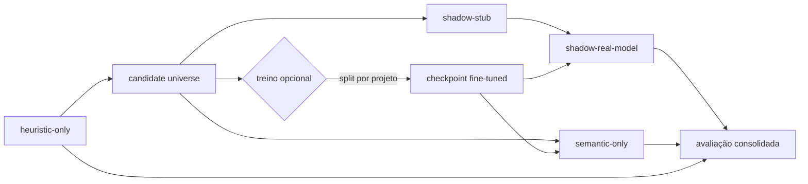

# Arquitetura experimental: caminho até o modo semantic-only

Documento curto para o TCC: visão do pipeline que leva da RMT heurística pura à avaliação **semantic-only**, alinhado a `docs/tcc/AGENTS.md` e `docs/tcc/SPEC.md`.

## Fluxo consolidado

O experimento é organizado em etapas encadeadas. O treino supervisionado (fine-tuning) é **opcional**: o semantic-only pode usar backends zero-shot ou ajustados; quando há ajuste, o dataset deriva do candidate universe com rótulos heurísticos.

**Leitura do diagrama**

| Etapa | Função |
|--------|--------|
| **heuristic-only** | RMT 2.0 sem IA: baseline, tempo, candidatos e rótulos operacionais. |
| **candidate universe** | JSONL com entidades positivas e negativas, código/contexto e metadados para treino e pareamento. |
| **treino opcional** | Construção de dataset a partir do universe, split preferencial por projeto, fine-tuning (ex.: GraphCodeBERT). |
| **shadow-stub** | Backend simulado em modo shadow: valida fio completo sem inferência real. |
| **shadow-real-model** | Modelo real em paralelo à heurística; decisão final da RMT permanece heurística. |
| **semantic-only** | Inferência só sobre o universe; a IA decide sem ler a decisão heurística na hora da predição; saída em JSONL dedicado. |
| **avaliação consolidada** | Avaliador (ex.: fluxo M5) agrega baseline, shadow e semantic-only: métricas, integridade, threshold sweep e relatórios. |

## Identificadores: `run_id`, `trace_id`, `entity_key_digest`

Três chaves com papéis distintos na rastreabilidade e no pareamento.

### `run_id`

Identifica **uma execução experimental** (um “run” de benchmark ou exportação). Agrupa artefatos sob o mesmo isolamento (pastas `experiments/runs/<run_id>/…`, pureza entre arquivos). Duas execuções sobre o mesmo repositório devem ter `run_id` diferentes para não misturar observações.

### `trace_id`

Identifica **uma observação experimental** no sentido de linha rastreável do export até a predição e a avaliação. Deve ser **único dentro do mesmo `run_id`** e **preservado** ao atravessar candidate universe → serviço de IA → predições semantic-only → avaliador. Quando a IA não avaliou a entidade, o pipeline pode materializar um `trace_id` sintético determinístico a partir de `run_id` e identidade da entidade, de modo que o mesmo run seja reproduzível e runs diferentes não colidam.

### `entity_key_digest`

Resumo criptográfico (ex.: SHA-256 em hexadecimal) de uma **chave canônica da entidade no espaço do experimento**: tipicamente combinação estável de projeto, caminho de arquivo, classe, assinatura do método e **padrão de design** avaliado. Serve para **identidade lógica** da linha no universe (uma observação por entidade × padrão), independentemente de quantas execuções existam. **Não substitui** o `trace_id`: o digest fixa *o quê* é a observação no domínio do código; o `trace_id` fixa *qual instância rastreável* daquela observação naquele `run_id`.

Em resumo: **`run_id`** = lote/execução; **`trace_id`** = chave de correlação ponta a ponta por observação no run; **`entity_key_digest`** = impressão digital estável da entidade+parâmetro de padrão para deduplicação e identidade semântica no corpus.

## Por que `shadow-stub` valida infraestrutura, não qualidade de IA

O backend **stub** responde com comportamento contratual previsível, sem carregar pesos nem refletir capacidade do modelo sobre código real. Ele comprova: conectividade RMT ↔ serviço de IA, HTTP/JSON, serialização JSONL, schema, geração ou preservação de `trace_id`, avaliador e regras de pureza. **Qualquer métrica de acerto/erro com o stub não mede aprendizado ou generalização**; usar esses números como “desempenho do modelo” seria uma conclusão metodologicamente inválida. O stub **isola falhas de ambiente e integração** das falhas de inferência do modelo real.

## O que o semantic-only mede (e o que não mede)

No modo **semantic-only** / **ai-only**, a IA produz decisões a partir do candidate universe **sem consultar o rótulo heurístico durante a inferência**; a comparação com a heurística ocorre **somente na avaliação**, em pareamento por `trace_id` (e chaves auxiliares que o avaliador definir).

Isso mede **aderência à referência operacional da RMT 2.0**: o quanto o classificador semântico **reproduz ou aproxima** as decisões programáticas da ferramenta sobre o mesmo universo de entidades. **Não** constitui prova de **superioridade absoluta** da IA sobre a heurística, nem “ground truth” externo validado por especialistas. A heurística é supervisão **operacional / fraca**; métricas altas indicam alinhamento ao comportamento instrumentado da RMT, não validação independente de correção de refatoração no mundo real.

---

**Referências internas:** `docs/tcc/AGENTS.md`, `docs/tcc/SPEC.md`.

**Mensagem de commit sugerida:** `docs(tcc): describe semantic-only experiment architecture`
