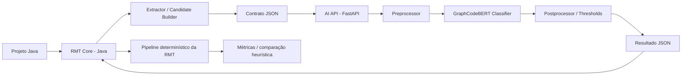

# SPEC — Módulo de IA da RMT com GraphCodeBERT

Versão: 1.0  
Data: 2026-04-02  
Autor base: Augusto Forte Padilla  
Contexto: TCC + implementação prática no ecossistema da RMT 2.0 de Pedro Magnus

---

## 1. Visão geral

Este documento especifica a arquitetura, stack, contratos, pipeline de dados, estratégia de treinamento, estratégia de inferência, critérios de avaliação e plano de implementação do módulo de Inteligência Artificial da **Refactoring and Measurement Tool (RMT)**.

A proposta foi desenhada para atender simultaneamente a dois objetivos:

1. **Objetivo acadêmico do TCC**: comparar uma abordagem baseada em IA com a abordagem heurística já utilizada pela RMT 2.0 para detecção de candidatos à refatoração.
2. **Objetivo operacional**: permitir uma integração limpa, reproduzível e de baixo atrito com o projeto do Pedro Magnus, preservando o desacoplamento entre **detecção** e **aplicação da refatoração**.

### 1.1 Resultado esperado

Ao final da implementação, a RMT deverá ser capaz de:

- extrair entidades de código Java elegíveis para análise;
- enviar essas entidades para um serviço externo de IA;
- receber uma classificação probabilística para os padrões:
  - `TEMPLATE_METHOD`
  - `STRATEGY`
  - `FACTORY_METHOD`
- manter a etapa de **aplicação determinística da refatoração** na própria RMT;
- comparar o comportamento da IA com a heurística existente no benchmark experimental.

---

## 2. Problema que o módulo resolve

A RMT 2.0 já detecta e aplica padrões de projeto, mas sua detecção depende de regras e heurísticas fixas. Isso limita a capacidade de identificar casos limítrofes ou estruturas semanticamente equivalentes que não coincidam exatamente com os limiares definidos.

O módulo de IA entra **antes** do pipeline de refatoração e atua como **serviço de detecção semântica de candidatos**.

### 2.1 O que este módulo faz

- recebe trechos de código e metadados estruturais;
- gera uma representação semântica do trecho;
- classifica o trecho como candidato ou não candidato para cada padrão-alvo;
- retorna probabilidades, justificativas técnicas e evidências operacionais.

### 2.2 O que este módulo não faz

- não reescreve código-fonte diretamente;
- não substitui o motor de refatoração da RMT;
- não altera métricas da RMT;
- não gera código com LLM generativa;
- não toma a decisão final de transformação sem passar pelo pipeline formal da RMT.

---

## 3. Decisão arquitetural principal

### 3.1 Escolha do modelo

**Modelo escolhido:** `microsoft/graphcodebert-base`

### 3.2 Justificativa da escolha

GraphCodeBERT é mais adequado que uma abordagem puramente sequencial porque considera não apenas tokens, mas também relações estruturais do código, especialmente **data flow**. Isso é valioso para padrões de projeto, porque a oportunidade de refatoração raramente depende apenas de palavras-chave; ela depende do papel que classes, métodos, variáveis e chamadas exercem no fluxo do programa.

### 3.3 Por que GraphCodeBERT e não CodeT5

Para este TCC, o problema central é **detecção/classificação**, não geração. Portanto:

- **GraphCodeBERT** é a escolha principal para compreender estrutura e semântica;
- **CodeT5** só faria mais sentido se o foco fosse gerar automaticamente sugestões de transformação ou patches de código.

### 3.4 Por que não usar prompt engineering como caminho principal

Prompt engineering com modelo generativo pode ser útil como baseline complementar, mas não deve ser a arquitetura principal do trabalho porque:

- introduz variabilidade de saída;
- dificulta reprodutibilidade experimental;
- aumenta risco de alucinação;
- torna mais difícil comparar consistentemente com a heurística da RMT 2.0.

**Decisão fechada:** o pipeline principal do projeto deve usar **fine-tuning/classificação supervisionada** com GraphCodeBERT, e não prompting aberto.

---

## 4. Princípios de arquitetura

1. **Desacoplamento forte**: detecção em Python, transformação em Java.
2. **Responsabilidade única**: IA detecta; RMT decide e aplica refatoração.
3. **Reprodutibilidade**: treinamento, inferência e benchmark devem ser repetíveis.
4. **Observabilidade**: toda análise precisa gerar logs, score e evidência.
5. **Compatibilidade com benchmark**: mesmo conjunto de projetos e mesmos padrões da RMT 2.0.
6. **Baixo atrito de integração**: contratos simples via HTTP/JSON.
7. **Escalabilidade gradual**: o MVP deve funcionar localmente; a arquitetura deve permitir crescimento posterior.

---

## 5. Escopo funcional

### 5.1 Padrões cobertos na primeira versão

- Template Method
- Strategy
- Factory Method

### 5.2 Granularidade de análise

A unidade de análise não deve ser o projeto inteiro. O módulo deve operar em **entidades candidatas**.

#### Unidades recomendadas por padrão

- **Template Method**: pares ou grupos de classes em hierarquia, com foco em métodos template e métodos variantes.
- **Strategy**: classes com variação comportamental, presença de condicionais ou algoritmos intercambiáveis, interfaces e implementações.
- **Factory Method**: métodos criadores, pontos de instanciação e relação criador-produto.

### 5.3 Saída esperada por entidade

Para cada entidade enviada à IA:

- `pattern_scores`: probabilidades por padrão;
- `predicted_labels`: rótulos acima do limiar;
- `confidence`: score consolidado;
- `evidence`: metadados e indícios usados na classificação;
- `explanation`: texto curto para auditoria;
- `trace_id`: identificador de correlação.

---

## 6. Arquitetura lógica



### 6.1 Componentes

#### A. RMT Core (Java)
Responsável por:
- parsear projeto Java;
- identificar entidades candidatas para inspeção;
- serializar entrada para o serviço de IA;
- consumir resposta do serviço;
- encaminhar candidatos aceitos para o motor de refatoração existente.

#### B. Candidate Builder (Java)
Responsável por:
- extrair recortes semanticamente úteis;
- reduzir código excessivo;
- montar payload padronizado;
- incluir metadados de contexto.

#### C. AI API (Python)
Responsável por:
- expor endpoints HTTP;
- validar payload;
- acionar pré-processamento e inferência;
- retornar resposta estruturada.

#### D. Classifier Service (Python)
Responsável por:
- tokenização;
- montagem de entrada do modelo;
- execução do GraphCodeBERT;
- cálculo de logits, probabilidades e labels.

#### E. Model Registry / Artifacts
Responsável por:
- armazenar checkpoints treinados;
- versionar thresholds;
- versionar label mapping;
- fixar configuração do experimento.

#### F. Evaluation Module
Responsável por:
- comparar heurística vs IA;
- gerar métricas;
- registrar falsos positivos e falsos negativos;
- armazenar julgamentos manuais.

---

## 7. Arquitetura física recomendada

### 7.1 Stack principal

#### Lado Java / RMT
- Java 17+
- Spring Boot (ou stack já usada pela RMT 2.0)
- JavaParser para AST e coleta estrutural
- WebClient para consumo do serviço HTTP da IA
- Maven ou Gradle, conforme padrão atual do projeto

#### Lado IA
- Python 3.10+
- FastAPI
- Uvicorn
- PyTorch
- Hugging Face Transformers
- Datasets
- scikit-learn
- pandas
- numpy

#### Infra local
- Docker
- Docker Compose
- volume persistente para modelos e logs

#### Persistência mínima
- SQLite no MVP **ou** PostgreSQL se a RMT já operar com banco integrado

### 7.2 Stack opcional para evolução

- Redis para fila assíncrona
- Celery/RQ para jobs longos
- MLflow ou W&B para rastreamento de experimentos
- ONNX Runtime para otimização de inferência
- Prometheus/Grafana para observabilidade

### 7.3 Decisão de MVP

Para o **MVP acadêmico e operacional**, a recomendação é:

- **sem fila externa no primeiro momento**;
- API HTTP com endpoint síncrono para análise por entidade;
- endpoint opcional assíncrono para lotes;
- armazenamento de artefatos em disco versionado.

Isso reduz complexidade inicial e acelera validação do TCC.

---

## 8. Contrato entre a RMT e o módulo de IA

### 8.1 Endpoint principal do MVP

`POST /api/v1/analyze`

### 8.2 Payload de entrada

```json
{
  "trace_id": "uuid",
  "project_id": "project-17",
  "entity_id": "src/main/java/foo/Bar.java::Bar::calculate",
  "language": "java",
  "entity_type": "class|method|hierarchy|creator",
  "pattern_scope": ["TEMPLATE_METHOD", "STRATEGY", "FACTORY_METHOD"],
  "source_code": "string",
  "context": {
    "file_path": "src/main/java/foo/Bar.java",
    "package_name": "foo",
    "class_name": "Bar",
    "method_name": "calculate",
    "super_class": "BaseBar",
    "interfaces": ["Rule"],
    "imports": ["java.util.*"],
    "metrics": {
      "loc": 87,
      "cc": 12,
      "dit": 2
    },
    "structural_hints": {
      "has_switch": true,
      "has_factory_calls": false,
      "uses_inheritance": true,
      "uses_composition": true
    }
  }
}
```

### 8.3 Resposta de saída

```json
{
  "trace_id": "uuid",
  "entity_id": "src/main/java/foo/Bar.java::Bar::calculate",
  "model": {
    "name": "graphcodebert-rmt-v1",
    "version": "1.0.0"
  },
  "predictions": [
    {
      "label": "TEMPLATE_METHOD",
      "score": 0.14,
      "decision": false
    },
    {
      "label": "STRATEGY",
      "score": 0.87,
      "decision": true
    },
    {
      "label": "FACTORY_METHOD",
      "score": 0.22,
      "decision": false
    }
  ],
  "top_prediction": "STRATEGY",
  "confidence": 0.87,
  "explanation": "Há variação comportamental encapsulável e indícios de algoritmo intercambiável.",
  "evidence": {
    "truncated": false,
    "input_tokens": 411,
    "window_strategy": "single-window",
    "features_used": [
      "code",
      "metadata",
      "structural_hints"
    ]
  }
}
```

### 8.4 Endpoint opcional para lote

`POST /api/v1/analyze/batch`

Uso recomendado apenas depois do endpoint unitário estar estável.

---

## 9. Estratégia de modelagem

### 9.1 Formulação do problema

O problema deve ser tratado como **classificação multilabel**.

### 9.2 Por que multilabel

Um mesmo recorte pode apresentar indícios compatíveis com mais de um padrão, especialmente em cenários envolvendo Strategy e Factory Method. Logo, é melhor evitar multiclass rígida na primeira versão.

### 9.3 Arquitetura do classificador

Recomendação principal:

- encoder: GraphCodeBERT
- cabeça de classificação: camada linear com 3 saídas
- ativação final: sigmoide
- loss: `BCEWithLogitsLoss`

### 9.4 Thresholds

Cada label deve possuir threshold próprio, ajustado em validação.

Exemplo inicial:

- Template Method: `0.50`
- Strategy: `0.55`
- Factory Method: `0.50`

Esses valores não são finais; devem ser calibrados a partir da curva precision-recall.

### 9.5 Estratégia de inferência

1. receber entidade candidata;
2. normalizar código;
3. reduzir ruído irrelevante;
4. aplicar tokenização;
5. executar o modelo;
6. converter logits em probabilidades;
7. aplicar thresholds por label;
8. retornar scores e evidências.

---

## 10. Pré-processamento do código

### 10.1 Regras gerais

- remover comentários puramente cosméticos, preservando javadocs apenas se forem úteis;
- preservar nomes de classes, métodos e variáveis;
- preservar assinatura, herança, interfaces e pontos de instanciação;
- reduzir imports não usados no trecho enviado;
- padronizar whitespace;
- nunca enviar o projeto inteiro de uma vez.

### 10.2 Estratégia de recorte

Como o modelo opera com contexto limitado, a entrada deve ser um **recorte centrado na entidade**.

#### Template Method
Enviar:
- classe base;
- método template;
- métodos abstratos/overridables relacionados;
- uma ou duas subclasses representativas, se necessário.

#### Strategy
Enviar:
- classe cliente/contexto;
- interface/abstração de estratégia;
- implementações mais relevantes;
- trecho condicional substituível, se existir.

#### Factory Method
Enviar:
- método criador;
- classe criadora;
- tipos retornados;
- pontos de uso da criação, quando fizer sentido.

### 10.3 Regra de truncamento

GraphCodeBERT não deve receber payload bruto e arbitrário. Se o recorte exceder o limite:

1. priorizar assinatura + corpo principal + tipos relacionados;
2. remover membros irrelevantes da classe;
3. dividir em janelas e agregar scores quando necessário.

### 10.4 Estratégia de janelas

Ordem recomendada:

- `single-window` para casos pequenos;
- `focused-window` para casos médios;
- `multi-window max-score` para casos grandes.

---

## 11. Extração estrutural no lado Java

### 11.1 Ferramenta recomendada

**JavaParser** deve ser a primeira escolha no lado Java para construir AST, localizar classes, métodos, herança, implementações, construtores, invocações e pontos de criação.

### 11.2 Metadados mínimos a extrair

- caminho do arquivo;
- pacote;
- nome da classe;
- superclasse;
- interfaces implementadas;
- assinaturas dos métodos;
- métodos sobrescritos;
- chamadas de método;
- expressões `new`;
- condicionais relevantes;
- métricas locais já disponíveis na RMT.

### 11.3 Heurísticas de pré-filtro

Antes de acionar a IA, a RMT pode aplicar um pré-filtro leve para reduzir custo:

- só enviar para Strategy classes com comportamento variante, condicionais ou composição por interface;
- só enviar para Template Method classes em hierarquia com método base e variação por subclasses;
- só enviar para Factory Method classes com criação encapsulada ou retorno polimórfico.

**Importante:** esse pré-filtro não deve substituir a IA; apenas reduzir chamadas desnecessárias.

---

## 12. Estratégia de dados e rotulagem

### 12.1 Fonte de dados principal

O benchmark principal deve continuar sendo o conjunto dos **17 projetos já usados na RMT 2.0**.

### 12.2 Construção do dataset

Cada amostra deve conter:

- código recortado;
- metadados estruturais;
- label por padrão;
- origem do rótulo;
- observação manual, quando houver.

### 12.3 Origem inicial dos rótulos

Ordem de prioridade:

1. **ground truth manual** em casos auditados;
2. heurística da RMT 2.0 como rótulo fraco inicial;
3. literatura e exemplos controlados para reforço do conjunto.

### 12.4 Estratégia recomendada de rotulagem

#### Fase 1 — Seed dataset
- usar saídas da RMT 2.0 como ponto de partida;
- coletar verdadeiros positivos já conhecidos;
- montar amostras negativas explícitas.

#### Fase 2 — Curadoria manual
- revisar casos ambíguos;
- revisar discordâncias heurística vs observação humana;
- registrar justificativa por amostra.

#### Fase 3 — Expansão
- gerar mais amostras por recorte alternativo;
- balancear labels;
- incluir hard negatives.

### 12.5 Formato sugerido do dataset

`jsonl`

```json
{
  "id": "sample-001",
  "project": "proj-a",
  "pattern_labels": {
    "TEMPLATE_METHOD": 0,
    "STRATEGY": 1,
    "FACTORY_METHOD": 0
  },
  "source_code": "...",
  "context": {
    "entity_type": "class",
    "metrics": {"loc": 76, "cc": 8},
    "uses_inheritance": true,
    "uses_composition": true
  },
  "label_source": "manual_review",
  "notes": "Condicional extensa substituível por estratégia."
}
```

---

## 13. Estratégia de treinamento

### 13.1 Primeira versão recomendada

- fine-tuning supervisionado do GraphCodeBERT;
- divisão treino/validação/teste por projeto, não por amostra solta, para evitar vazamento;
- early stopping;
- class weights ou balanceamento, se necessário.

### 13.2 Particionamento

Evitar misturar amostras do mesmo projeto em treino e teste sempre que possível.

Recomendação:

- treino: 60–70%
- validação: 15–20%
- teste: 15–20%

Se o número de projetos for pequeno, complementar com validação cruzada por projeto.

### 13.3 Hiperparâmetros iniciais

Valores iniciais sugeridos:

- max_length: 512
- learning_rate: 2e-5
- batch_size: 4 a 8
- epochs: 3 a 8
- weight_decay: 0.01
- warmup_ratio: 0.1
- optimizer: AdamW

### 13.4 Métricas de treino

- loss de treino
- loss de validação
- macro precision
- macro recall
- macro F1
- F1 por padrão
- PR-AUC por padrão

### 13.5 Artefatos gerados

- tokenizer config
- model weights
- label mapping
- thresholds calibrados
- relatório de treino
- matriz de confusão por label

---

## 14. Estratégia de avaliação experimental

### 14.1 Comparações obrigatórias

1. **RMT 2.0 heurística** vs **RMT + IA**
2. por projeto
3. por padrão
4. agregado final

### 14.2 Métricas principais

- precisão
- revocação
- F1
- accuracy de concordância
- overlap com heurística
- taxa de discordância
- tempo médio por análise

### 14.3 Análise de discordâncias

#### Caso A
IA detecta, heurística não detecta.

Pergunta de avaliação: a IA encontrou um candidato real ou gerou falso positivo?

#### Caso B
Heurística detecta, IA não detecta.

Pergunta de avaliação: a heurística encontrou um caso correto que a IA perdeu?

### 14.4 Evidência operacional

Cada caso relevante deve registrar:

- trecho analisado;
- score por padrão;
- decisão final;
- justificativa humana;
- resultado da heurística;
- observação do pesquisador.

### 14.5 Saídas desejadas para o capítulo 4

- tabela por projeto;
- tabela por padrão;
- exemplos qualitativos de acerto da IA;
- exemplos qualitativos de erro da IA;
- discussão sobre limitações do dataset e do recorte.

---

## 15. Decisão sobre síncrono vs assíncrono

### 15.1 Recomendação prática

#### Para o MVP
Usar **endpoint síncrono** por entidade:
- implementação mais simples;
- depuração mais fácil;
- menor custo arquitetural;
- suficiente para experimentos controlados.

#### Para lotes ou produção acadêmica ampliada
Adicionar **fluxo assíncrono**:
- `POST /jobs`
- `GET /jobs/{id}`
- processamento em worker separado.

### 15.2 Decisão fechada

No spec principal, a arquitetura deve ser descrita como **compatível com assíncrono**, mas a implementação inicial pode ser **síncrona** sem prejuízo metodológico, desde que a comunicação permaneça desacoplada via API.

---

## 16. Repositório e organização de pastas

### 16.1 Estrutura recomendada

```text
rmt/
├─ rmt-core/                     # Java
│  ├─ src/main/java/...
│  ├─ src/test/java/...
│  └─ ...
├─ rmt-ai-service/               # Python
│  ├─ app/
│  │  ├─ api/
│  │  ├─ core/
│  │  ├─ models/
│  │  ├─ services/
│  │  ├─ schemas/
│  │  └─ main.py
│  ├─ training/
│  │  ├─ datasets/
│  │  ├─ scripts/
│  │  ├─ configs/
│  │  └─ notebooks/
│  ├─ tests/
│  ├─ artifacts/
│  ├─ requirements.txt
│  └─ Dockerfile
├─ datasets/
│  ├─ raw/
│  ├─ interim/
│  └─ processed/
├─ experiments/
│  ├─ exp-001/
│  ├─ exp-002/
│  └─ ...
├─ docs/
│  ├─ SPEC_RMT_GraphCodeBERT_Modulo_IA.md
│  ├─ API_CONTRACT.md
│  └─ EVALUATION_PROTOCOL.md
└─ docker-compose.yml
```

### 16.2 Decisão sobre mono vs multi-repo

Se a RMT do Pedro Magnus já estiver bem segmentada em microsserviços, o mais seguro é manter o módulo como **repositório separado**: `rmt-ai-service`.

Se o ambiente de desenvolvimento estiver simples e local, pode ficar em monorepo apenas para facilitar build e testes.

**Recomendação:** separar logicamente o serviço de IA, mesmo que inicialmente esteja no mesmo workspace.

---

## 17. API interna do serviço de IA

### 17.1 Endpoints mínimos

- `GET /health`
- `POST /api/v1/analyze`
- `POST /api/v1/analyze/batch` (opcional)
- `GET /api/v1/model/info`

### 17.2 Endpoint de health

Deve retornar:

```json
{
  "status": "ok",
  "model_loaded": true,
  "model_name": "graphcodebert-rmt-v1"
}
```

### 17.3 Endpoint de model info

Deve retornar:

- nome do checkpoint
- data do treinamento
- labels suportados
- thresholds ativos
- hash/config da execução

---

## 18. Observabilidade e rastreabilidade

### 18.1 Logs obrigatórios

- `trace_id`
- projeto
- entidade
- tempo de inferência
- tamanho da entrada
- scores
- decisão final
- erro, se houver

### 18.2 Boas práticas

- logs estruturados em JSON;
- correlação entre RMT e AI service pelo `trace_id`;
- persistência de resultados experimentais em arquivo ou banco.

### 18.3 Reprodutibilidade

Toda rodada experimental deve registrar:

- commit da RMT;
- commit do serviço de IA;
- versão do modelo;
- dataset version;
- thresholds;
- configuração de hardware.

---

## 19. Segurança e robustez

### 19.1 Validação de entrada

- recusar payload vazio;
- limitar tamanho do código;
- validar labels e tipos;
- sanitizar campos textuais.

### 19.2 Timeouts

- timeout de chamada HTTP entre RMT e AI service;
- retry controlado para erros transitórios;
- fallback claro em caso de indisponibilidade.

### 19.3 Política de fallback

Se o serviço de IA estiver indisponível:

1. registrar erro;
2. marcar entidade como `AI_UNAVAILABLE`;
3. permitir que a RMT siga apenas com a heurística, se desejado.

---

## 20. Estratégia de testes

### 20.1 No lado Python

- testes unitários do pré-processamento;
- testes do contrato de entrada/saída;
- testes de inferência com fixtures;
- teste de health endpoint;
- teste de carregamento de modelo.

### 20.2 No lado Java

- testes do extractor;
- testes do candidate builder;
- testes do cliente HTTP;
- testes de fallback;
- testes de integração com mock do AI service.

### 20.3 Testes ponta a ponta

Fluxo mínimo:
1. projeto Java de exemplo;
2. extração de entidade;
3. chamada ao serviço;
4. resposta válida;
5. encaminhamento ao pipeline da RMT.

---

## 21. Plano de implementação recomendado

### Fase 0 — Alinhamento

- confirmar contrato final da RMT 2.0;
- mapear pontos de extensão no projeto do Pedro Magnus;
- definir entidade mínima de análise por padrão.

### Fase 1 — Base do serviço

- criar `rmt-ai-service`;
- subir FastAPI + health;
- carregar checkpoint base do GraphCodeBERT;
- implementar endpoint `analyze` com resposta mock.

### Fase 2 — Extração Java

- implementar extractor com JavaParser;
- serializar payload mínimo;
- integrar cliente HTTP no lado da RMT.

### Fase 3 — Dataset

- montar dataset inicial com saídas da RMT 2.0;
- revisar manualmente amostras-chave;
- gerar splits por projeto.

### Fase 4 — Treinamento

- fine-tuning inicial;
- calibrar thresholds;
- salvar checkpoint `graphcodebert-rmt-v1`.

### Fase 5 — Integração real

- ligar RMT ao serviço treinado;
- registrar scores;
- permitir comparação lado a lado com heurística.

### Fase 6 — Avaliação experimental

- executar benchmark completo;
- coletar métricas;
- montar tabela comparativa;
- selecionar estudos de caso.

### Fase 7 — Consolidação do TCC

- transformar resultados em texto do Capítulo 4;
- registrar limitações e ameaças à validade;
- fechar conclusão e trabalhos futuros.

---

## 22. Riscos principais e mitigação

### Risco 1 — Dataset pequeno
**Mitigação:** usar rotulagem fraca + revisão manual + hard negatives.

### Risco 2 — Vazamento entre treino e teste
**Mitigação:** split por projeto e não apenas por amostra.

### Risco 3 — Entrada grande demais
**Mitigação:** candidate builder com recorte centrado e janelas.

### Risco 4 — Integração difícil com a RMT
**Mitigação:** contrato HTTP mínimo e serviço isolado.

### Risco 5 — IA parecer “caixa-preta” demais no TCC
**Mitigação:** retornar explicação curta, score, evidência e análise de discordâncias.

### Risco 6 — Complexidade excessiva para o prazo
**Mitigação:** MVP síncrono, sem fila externa, sem geração automática de código.

---

## 23. Definição de pronto

O módulo será considerado pronto quando:

1. a RMT conseguir enviar entidades reais para o serviço de IA;
2. o serviço responder com scores e labels válidos;
3. o modelo estiver treinado em dataset reproduzível;
4. houver comparação experimental com a heurística da RMT 2.0;
5. os resultados puderem ser descritos com clareza nos capítulos 3 e 4 do TCC.

---

## 24. Decisões finais fechadas

### Decisão 1
O módulo de IA será um **serviço independente em Python**.

### Decisão 2
A RMT continuará responsável pela **aplicação determinística da refatoração**.

### Decisão 3
O modelo principal será o **GraphCodeBERT**.

### Decisão 4
O problema será tratado como **classificação multilabel**.

### Decisão 5
A integração inicial será por **HTTP/JSON**, com endpoint síncrono no MVP.

### Decisão 6
A extração estrutural no lado Java usará **JavaParser**.

### Decisão 7
A avaliação seguirá o **mesmo benchmark da RMT 2.0** e comparará diretamente heurística vs IA.

### Decisão 8
A primeira versão não fará geração de código e não substituirá o motor da RMT.

---

## 25. Resumo executivo

A melhor forma de projetar o teu módulo de IA para a RMT é tratá-lo como um **microserviço de classificação semântica**, com GraphCodeBERT como encoder principal, integrado por API ao núcleo Java da ferramenta, usando extração estrutural no lado da RMT e mantendo a refatoração final no pipeline determinístico existente.

Em termos práticos, isso te dá:

- coerência com o TCC;
- comparação experimental limpa;
- baixo risco arquitetural;
- alta defendibilidade metodológica;
- chance real de implementar dentro do prazo sem explodir o escopo.

